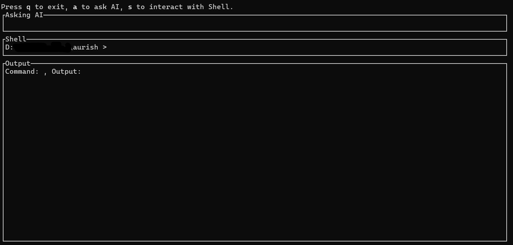
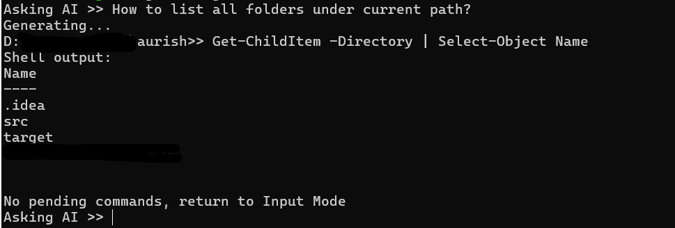

# Aurish
An AI integrated Shell, where you can review and modify AI given commands and then execute them seamlessly without annoying copy&paste. Everything is in your control with Aurish, it runs completely offline, and all the data are stored locally.

> [!NOTE]
> For privacy and safety concerns, Aurish only supports OLLAMA models for now.

## Overview
This project has two binaries, `aurish` and `aurish-cli`. `aurish` is a asynchronous TUI program which contains an AI chatbox and an interactive shell box where AI suggested commands will wait for your action. You can also use the shell box as a real shell, on windows the default shell is `PowerShell`. While `aurish-cli` is a lightweight synchronous CLI program which focusing on simple interaction with AI and suggested commands. Although it doesn't support entering shell commands yourself, you can still review and modify AI given commands before executing. 
### aurish

### aurish-cli


## How to use
> [!CAUTION]
> AI suggested commands might do harm to your device, always review before executing!
> Use it at your own risk.
0. Make sure `Ollama` server is running  

1. Use `aurish-cli` to set the configuration, including **model name**, **Ollama api endpoint** and **proxy**.  
You can type `aurish-cli --help` to see all available flags and commands.  
The default setting is
```json
{
	"ollama_api": "http://localhost:11434/api/generate",
	"model": "llama3:latest",
	"proxy": "",
}
```
Please note that the endpoint should be `/api/generate`.  

2. Use `aurish-cli dry-run` to test accessibility of Ollama server.  
You will see something like this:

```
Data to send: OllamaReq {
    model: "llama3:latest",
    prompt: "",
    stream: false,
    format: Object {
        "properties": Object {
            "commands": Object {
                "type": String("array"),
            },
        },
        "required": Array [
            String("commands"),
        ],
        "type": String("object"),
    },
    system: "You are PowerShell expert, your task is give PowerShell commands that meets user requirements. Your answer should only contains commands. Respond using JSON.",
}
ollama response: ["dir", "md test"]
```


4. Once everything set, type `aurish` to use  
   If you want to use `aurish-cli`, type `aurish-cli run`. You can quit `aurish-cli` with `CTRL-C` anytime you want. 


## Install
Download the pre-build binary at [release](https://github.com/DaZuo0122/aurish/releases).  

## Build 
0. Make sure you have Rust 2021 edition installed. 

1. Clone this repo

3. `cd aurish` and `cargo build --release`
